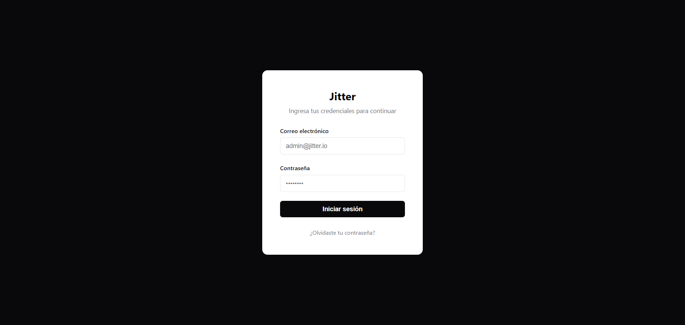

# Jitter Lab

<div align="center">

[](https://nodejs.org/)
[](https://expressjs.com/)
[](https://www.sqlite.org/)
[](https://jwt.io/)
[](https://handlebarsjs.com/)
[](https://www.docker.com/)

</div>

<div align="center">
  
</div>

---

> [!IMPORTANT]
> Este laboratorio no incluye exploits automatizados ni soluciones predefinidas. El foco está en el razonamiento y la investigación; la documentación proporciona toda la información necesaria para que el reto pueda ser resuelto.

---

> [!NOTE]
> **Arquitectura del Laboratorio**
>
> - **Lógica**: No hay trucos en el navegador. Todo se procesa en el servidor, obligando a investigar el tráfico de red, las cookies y las peticiones HTTP reales.
> - **Diseño**: Un entorno minimalista y profesional que oculta sus fallos de seguridad detrás de una apariencia seria.

---

## Concepto y Diseño

Para entender la filosofía detrás de este laboratorio y detalles técnicos adicionales, consulta el documento de concepto:

> [!TIP]
> **[Leer CONCEPT](CONCEPT.md)**

> [!NOTE]
> **[Leer Writeup](WRITEUP.md)**
> Los `scripts` usados se encuentran en la carpeta `tools/`

---

## Configuración y Ejecución Local

### 1. Instalación

```bash
git clone https://github.com/froddodev/jitter.git
cd jitter
npm install
```

### 2. Ejecución

- **Manual**: `npm start`
- **Docker**: `docker-compose up --build -d`

_La aplicación estará disponible en [http://localhost:3000](http://localhost:3000)_

---

## Desafíos y Objetivos

| Objective                   | Challenge                                                          | Vulnerability                                                                                                                    |
| :-------------------------- | :----------------------------------------------------------------- | :------------------------------------------------------------------------------------------------------------------------------- |
| **Reconocimiento**          | Enumeración de cuentas mediante análisis de discrepancia temporal. | [Timing Attack](https://portswigger.net/web-security/authentication/password-based/lab-username-enumeration-via-response-timing) |
| **Escalada de Privilegios** | Compromiso de secretos de sesión y manipulación de identidad.      | [JWT Weak Secret](https://portswigger.net/web-security/jwt/lab-jwt-authentication-bypass-via-weak-signing-key)                   |
| **Bypass**                  | Evasión de controles de red y bypass de rate limiting.             | [IP Spoofing](https://www.verylazytech.com/bypass-rating-limit)                                                                  |

---

## Configuración del Reto

### Usuarios Base

La base de datos se siembra automáticamente al iniciar la app. El ataque de fuerza bruta debe ser preciso debido al Rate Limiter (15 req/min).

### Mitigación y Defensas

El lab simula un entorno real con **Rate Limiting** dinámico y **Simulación de Proxy** (`X-Forwarded-For`), enseñando por qué confiar ciegamente en cabeceras de red es un error de seguridad crítico.

---

> [!TIP]
> **Metodología de Resolución**: Este laboratorio está diseñado para ser **un desafío logico**. Superar las capas de seguridad exige el uso de herramientas (como Burp Suite, Hashcat o Ruby/Python) y la creación de **scripts personalizados**. No existen atajos que resuelvan el flujo completo.

---

> [!NOTE]
> **Nota del Desarrollador:**
>
> Este laboratorio ha sido construido para profundizar en vulnerabilidades desde sus cimientos. No se trata solo de "romper cosas", sino de comprender la arquitectura detrás de ello. Ha sido un proceso de aprendizaje increíble donde, de paso, pude reírme un rato con la seguridad (in)existente. ;)
>
> Solo un Mearas no respetara el Rate Limit. — Lord of the Rings.

---

## Licencia

Este laboratorio está bajo la [Licencia MIT](LICENSE).
